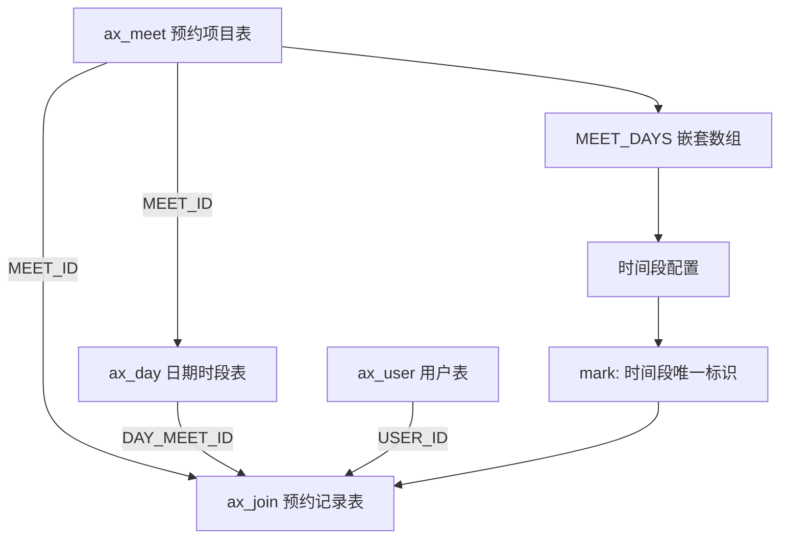

# 预约系统数据库接口文档

## 项目配置信息

### 微信小程序配置
- **AppID**: `wxf76ea9bf5982dd05`
- **云开发环境ID**: `cloud1-3ggfodggf223466a`
- **secret**: `4af9e95c1d4394f0b48d33b9e90d22a8`
- **项目名称**: V1.0小程序
- **框架版本**: CCMiniCloud Framework 2.0.1
- **get access token**: `https://api.weixin.qq.com/cgi-bin/token?grant_type=client_credential&appid=wxf76ea9bf5982dd05&secret=4af9e95c1d4394f0b48d33b9e90d22a8`

93_Q_Vz2s9Y-NOwTpjt3S9DuXp3IJl0P0Y4ae3lncfghjVLTinrBQ-G-1f7416C1AxZa96lZOtEL_UtLYsn70YxmAVtw87QahJU08Ev2AfTbCFuu1Pm-shqH1qp5xMSFNjAFAMZH

### 数据库集合结构

#### 1. 预约项目表 (ax_meet)
```javascript
{
  _pid: 'string|true',                    // 项目ID
  MEET_ID: 'string|true',                 // 预约项目唯一ID
  MEET_ADMIN_ID: 'string|true',           // 添加的管理员ID
  MEET_TITLE: 'string|true',              // 项目标题
  MEET_CONTENT: 'array|true|default=[]',  // 详细介绍内容
  MEET_DAYS: 'array|true|default=[]',     // 可用日期数组
  MEET_SEAT_COUNT: 'int|true|default=0',  // 总座位数
  MEET_FORM_SET: 'array|true|default=[]', // 表单字段设置
  MEET_STATUS: 'int|true|default=1',      // 状态: 0=未启用,1=使用中,9=停止预约,10=已关闭
  MEET_ORDER: 'int|true|default=9999',    // 排序
  MEET_ADD_TIME: 'int|true',              // 添加时间戳
  MEET_EDIT_TIME: 'int|true',             // 编辑时间戳
  MEET_ADD_IP: 'string|false',            // 添加IP
  MEET_EDIT_IP: 'string|false'            // 编辑IP
}
```

#### 2. 预约记录表 (ax_join)
```javascript
{
  _pid: 'string|true',                           // 项目ID
  JOIN_ID: 'string|true',                        // 预约记录唯一ID
  JOIN_EDIT_ADMIN_ID: 'string|false',            // 最近修改的管理员ID
  JOIN_EDIT_ADMIN_NAME: 'string|false',          // 最近修改的管理员名
  JOIN_EDIT_ADMIN_TIME: 'int|true|default=0',    // 管理员最近修改时间
  JOIN_EDIT_ADMIN_STATUS: 'int|false',           // 管理员修改的状态
  JOIN_IS_ADMIN: 'int|true|default=0',           // 是否管理员添加 0/1
  JOIN_CODE: 'string|true',                      // 核验码15位
  JOIN_IS_CHECKIN: 'int|true|default=0',         // 是否签到 0/1
  JOIN_USER_ID: 'string|true',                   // 用户ID
  JOIN_MEET_ID: 'string|true',                   // 预约项目ID
  JOIN_MEET_TITLE: 'string|true',                // 项目标题
  JOIN_MEET_DAY: 'string|true',                  // 预约日期
  JOIN_MEET_TIME_START: 'string|true',           // 时段开始时间
  JOIN_MEET_TIME_END: 'string|true',             // 时段结束时间
  JOIN_MEET_TIME_MARK: 'string|true',            // 时段标识
  JOIN_START_TIME: 'int|true',                   // 开始时间戳
  JOIN_FORMS: 'array|true|default=[]',           // 用户填写的表单数据
  JOIN_SEATS: 'array|true|default=[]',           // 预约的座位号数组
  JOIN_STATUS: 'int|true|default=1',             // 状态: 1=预约成功,10=已取消,99=系统取消
  JOIN_REASON: 'string|false',                   // 取消理由
  JOIN_ADD_TIME: 'int|true',                     // 添加时间戳
  JOIN_EDIT_TIME: 'int|true',                    // 编辑时间戳
  JOIN_ADD_IP: 'string|false',                   // 添加IP
  JOIN_EDIT_IP: 'string|false'                   // 编辑IP
}
```

#### 3. 日期时段表 (ax_day)
```javascript
{
  _pid: 'string|true',                    // 项目ID
  DAY_ID: 'string|true',                  // 日期记录唯一ID
  DAY_MEET_ID: 'string|true',             // 关联的预约项目ID
  day: 'string|true',                     // 日期 yyyy-mm-dd
  dayDesc: 'string|true',                 // 日期描述
  times: 'array|true',                    // 时间段数组
  /* times数组结构:
  {
    mark: '唯一性标识',
    start: '开始时间点hh:mm',
    end: '结束时间点hh:mm',
    seats: '座位设置',
    status: '状态 0/1',
    stat: {
      succCnt: '预约成功数量',
      cancelCnt: '已取消数量',
      adminCancelCnt: '后台取消数量'
    }
  }
  */
  DAY_ADD_TIME: 'int|true',               // 添加时间戳
  DAY_EDIT_TIME: 'int|true',              // 编辑时间戳
  DAY_ADD_IP: 'string|false',             // 添加IP
  DAY_EDIT_IP: 'string|false'             // 编辑IP
}
```

#### 4. 用户表 (ax_user)
```javascript
{
  _pid: 'string|true',                    // 项目ID
  USER_ID: 'string|true',                 // 用户唯一ID
  USER_MINI_OPENID: 'string|true',        // 小程序openid
  USER_STATUS: 'int|true|default=1',      // 状态: 0=待审核,1=正常
  USER_NAME: 'string|false',              // 用户姓名
  USER_MOBILE: 'string|false',            // 联系电话
  USER_AVATAR_URL: 'string|false',        // 用户头像URL
  USER_WORK: 'string|false',              // 所在单位
  USER_CITY: 'string|false',              // 所在城市
  USER_TRADE: 'string|false',             // 职业领域
  USER_LOGIN_CNT: 'int|true|default=0',   // 登录次数
  USER_LOGIN_TIME: 'int|false',           // 最近登录时间
  USER_ADD_TIME: 'int|true',              // 添加时间戳
  USER_ADD_IP: 'string|false',            // 添加IP
  USER_EDIT_TIME: 'int|true',             // 编辑时间戳
  USER_EDIT_IP: 'string|false'            // 编辑IP
}
```

## API接口列表

### 用户端接口

#### 1. 用户认证相关
- **POST** `passport/wx_login` - 微信登录
- **GET** `passport/my_detail` - 获取用户详情
- **POST** `passport/edit_base` - 编辑用户基本信息
- **GET** `passport/phone` - 获取用户手机号

#### 2. 预约项目相关
- **GET** `meet/list` - 获取预约项目列表
- **GET** `meet/list_by_day` - 按日期获取预约项目
  ```javascript
  // 请求参数
  {
    day: 'YYYY-MM-DD',        // 必填，查询日期
    forceRefresh: 'string'    // 可选，强制刷新缓存
  }
  ```
- **GET** `meet/list_has_day` - 获取有预约的日期列表
- **GET** `meet/view` - 查看预约项目详情
- **GET** `meet/detail_for_join` - 获取预约详情（用于预约）
- **POST** `meet/before_join` - 预约前检查
- **POST** `meet/join` - 提交预约
  ```javascript
  // 请求参数
  {
    meetId: 'string',         // 预约项目ID
    timeMark: 'string',       // 时段标识
    forms: 'array',           // 表单数据
    seats: 'array'            // 座位号数组
  }
  ```
- **GET** `meet/get_reserved_seats` - 获取已预约座位
  ```javascript
  // 请求参数
  {
    meetId: 'string',         // 预约项目ID
    timeMark: 'string'        // 时段标识
  }
  ```

#### 3. 我的预约相关
- **GET** `my/my_join_list` - 我的预约列表
- **POST** `my/my_join_cancel` - 取消我的预约
- **GET** `my/my_join_detail` - 我的预约详情
- **GET** `my/my_join_someday` - 我的某日预约
- **POST** `my/my_join_checkin` - 用户自助签到

### 管理员接口

#### 1. 管理员认证
- **POST** `admin/login` - 管理员登录
- **GET** `admin/home` - 管理员首页数据
- **POST** `admin/clear_cache` - 清除缓存

#### 2. 预约项目管理
- **GET** `admin/meet_list` - 管理员获取预约项目列表
- **POST** `admin/meet_insert` - 添加预约项目
- **GET** `admin/meet_detail` - 获取预约项目详情
- **POST** `admin/meet_edit` - 编辑预约项目
- **POST** `admin/meet_del` - 删除预约项目
- **POST** `admin/meet_update_content` - 更新项目内容
- **POST** `admin/meet_update_style` - 更新项目样式
- **POST** `admin/meet_sort` - 项目排序
- **POST** `admin/meet_status` - 修改项目状态

#### 3. 预约记录管理
- **GET** `admin/meet_join_list` - 获取预约记录列表
- **POST** `admin/join_status` - 修改预约状态
- **POST** `admin/join_del` - 删除预约记录
- **POST** `admin/meet_cancel_time_join` - 按时段取消预约
- **POST** `admin/join_scan` - 扫码核验
- **POST** `admin/join_checkin` - 管理员签到
- **GET** `admin/self_checkin_qr` - 生成自助签到二维码
- **GET** `admin/meet_day_list` - 获取日期列表

#### 4. 用户管理
- **GET** `admin/user_list` - 用户列表
- **GET** `admin/user_detail` - 用户详情
- **POST** `admin/user_del` - 删除用户

#### 5. 数据导出
- **GET** `admin/join_data_get` - 获取预约数据
- **POST** `admin/join_data_export` - 导出预约数据
- **POST** `admin/join_data_del` - 删除导出数据
- **GET** `admin/user_data_get` - 获取用户数据
- **POST** `admin/user_data_export` - 导出用户数据
- **POST** `admin/user_data_del` - 删除用户导出数据

#### 6. 模板管理
- **POST** `admin/temp_insert` - 添加模板
- **GET** `admin/temp_list` - 模板列表
- **POST** `admin/temp_del` - 删除模板
- **POST** `admin/temp_edit` - 编辑模板

#### 7. 系统管理
- **POST** `admin/setup_about` - 设置关于信息
- **POST** `admin/setup_contact` - 设置联系方式
- **GET** `admin/setup_qr` - 生成小程序码
- **GET** `admin/log_list` - 系统日志列表

## 数据库逻辑表设计

### 🏗️ 预约系统业务架构

#### 1. 业务流程概述
```
管理员创建预约窗口 → 设置可预约日期和时间段 → 用户查看并预约 → 管理员管理预约记录
```

#### 2. 核心业务逻辑

##### 📋 预约窗口管理（管理员层）
```javascript
// 步骤1: 管理员创建预约项目
ax_meet 表插入记录 {
  MEET_ID: "项目唯一标识",
  MEET_TITLE: "项目名称", 
  MEET_STATUS: 1,  // 启用状态
  MEET_SEAT_COUNT: 50,  // 座位数
  MEET_FORM_SET: [...],  // 用户填写表单配置
  MEET_DAYS: [...]  // 可预约日期和时间段配置
}

// 步骤2: 系统自动生成详细的日期时间段
ax_day 表批量插入 {
  DAY_MEET_ID: "关联的MEET_ID",
  day: "2025-06-15",
  times: [{
    mark: "T20250615AAATZKWHFAZVO",  // 唯一时间段标识
    start: "09:00",
    end: "12:00", 
    status: 1,  // 开放状态
    limit: 30,  // 人数限制
    stat: { succCnt: 0, cancelCnt: 0 }  // 统计信息
  }]
}
```

##### 👤 用户预约流程（用户层）
```javascript
// 步骤1: 用户查看可用预约窗口
SELECT * FROM ax_meet WHERE MEET_STATUS = 1

// 步骤2: 查看具体日期的时间段
从 ax_meet.MEET_DAYS 或 ax_day 获取可用时间段

// 步骤3: 提交预约（必须关联已存在的窗口和时间段）
ax_join 表插入记录 {
  JOIN_MEET_ID: "必须是有效的窗口ID",
  JOIN_MEET_TIME_MARK: "必须是有效的时间段标识",
  JOIN_MEET_DAY: "预约日期",
  JOIN_FORMS: [
    {mark: "VPFCGOHJFV", title: "姓名", val: "张三"},
    {mark: "XAWSQRZWGK", title: "手机", val: "13800138000"}
  ],
  JOIN_SEATS: [1, 3],  // 预约的座位
  JOIN_STATUS: 1  // 预约成功
}
```

#### 3. 数据表关联关系



#### 4. 关键字段关联逻辑

##### 🔗 主键关联
- `ax_meet._id` ← `ax_join.JOIN_MEET_ID` (预约必须关联已存在的项目)
- `ax_meet.MEET_ID` ← `ax_day.DAY_MEET_ID` (日期时段归属于项目)
- `ax_user.USER_ID` ← `ax_join.JOIN_USER_ID` (预约归属于用户)

##### 🎯 时间段关联
- `ax_meet.MEET_DAYS[].times[].mark` ← `ax_join.JOIN_MEET_TIME_MARK`
- `ax_day.times[].mark` ← `ax_join.JOIN_MEET_TIME_MARK`

##### 📊 状态控制
```javascript
// 预约项目状态控制预约是否可见
if (ax_meet.MEET_STATUS === 1) {
  // 项目可用，用户可以看到并预约
}

// 时间段状态控制是否可预约
if (ax_day.times[i].status === 1) {
  // 时间段开放，用户可以预约
}

// 预约记录状态控制预约的生命周期
ax_join.JOIN_STATUS: {
  1: "预约成功",
  10: "用户取消", 
  99: "管理员取消"
}
```

#### 5. 业务规则和约束

##### ✅ 数据完整性约束
1. **预约窗口约束**：
   - `JOIN_MEET_ID` 必须存在于 `ax_meet._id`
   - 对应的预约项目 `MEET_STATUS` 必须为 1

2. **时间段约束**：
   - `JOIN_MEET_TIME_MARK` 必须存在于项目的时间段配置中
   - 对应时间段的 `status` 必须为 1

3. **座位约束**：
   - `JOIN_SEATS` 中的座位号不能超过 `MEET_SEAT_COUNT`
   - 同一时间段的座位不能重复预约

##### 🔐 业务逻辑约束
1. **预约流程约束**：
   ```javascript
   // 创建预约时必须验证
   - 预约项目是否存在且启用
   - 时间段是否存在且开放
   - 座位是否可用
   - 用户信息是否完整
   ```

2. **数据一致性约束**：
   ```javascript
   // 预约成功后更新统计
   ax_day.times[i].stat.succCnt += 1
   
   // 取消预约后更新统计
   ax_day.times[i].stat.cancelCnt += 1
   ```

#### 6. 典型查询模式

##### 📋 管理员查询
```javascript
// 获取项目的所有预约记录
SELECT * FROM ax_join 
WHERE JOIN_MEET_ID = '项目ID' 
AND JOIN_STATUS IN (1, 10, 99)

// 获取特定时间段的预约
SELECT * FROM ax_join 
WHERE JOIN_MEET_TIME_MARK = '时间段标识'
```

##### 👤 用户查询
```javascript
// 按手机号查询预约
SELECT * FROM ax_join 
WHERE JOIN_FORMS LIKE '%"title":"手机","val":"13800138000"%'

// 按姓名查询预约  
SELECT * FROM ax_join
WHERE JOIN_FORMS LIKE '%"title":"姓名","val":"张三"%'
```

##### 📊 统计查询
```javascript
// 统计项目预约情况
SELECT 
  JOIN_STATUS,
  COUNT(*) as count
FROM ax_join 
WHERE JOIN_MEET_ID = '项目ID'
GROUP BY JOIN_STATUS
```

#### 7. 扩展字段说明

##### 📝 表单数据结构 (JOIN_FORMS)
```javascript
[
  {
    mark: "VPFCGOHJFV",     // 字段唯一标识
    title: "姓名",          // 字段显示名称
    type: "line",           // 字段类型
    val: "张三"             // 用户填写的值
  },
  {
    mark: "XAWSQRZWGK", 
    title: "手机",
    type: "line", 
    val: "13800138000"
  }
]
```

##### 🪑 座位数据结构 (JOIN_SEATS)
```javascript
[0, 2, 5]  // 数组索引，表示预约了1号、3号、6号座位
```

##### ⏰ 时间戳字段统一说明
- 所有 `*_ADD_TIME` 和 `*_EDIT_TIME` 字段均为13位毫秒时间戳
- `JOIN_START_TIME` 为预约时间段开始的时间戳
- 时间戳统一使用服务器时区

#### 8. 缓存策略

##### 📦 缓存机制
```javascript
// 预约项目列表缓存
cache_key: `meet_list_${day}`
expire: 30分钟

// 已预约日期缓存  
cache_key: `has_day_${month}`
expire: 24小时

// 座位预约状态缓存
cache_key: `seats_${meetId}_${timeMark}` 
expire: 5分钟
```

## 数据库连接配置

### 云开发配置
```javascript
// 在 miniprogram/app.js 中
wx.cloud.init({
  env: 'cloud1-3ggfodggf223466a',  // 云环境ID
  traceUser: true,
})
```

### 云函数配置
```javascript
// 在 cloudfunctions/cloud/framework/cloud/cloud_base.js 中
cloud.init({
  env: 'cloud1-3ggfodggf223466a'   // 云环境ID
})
```

## 状态码说明

### 预约项目状态 (MEET_STATUS)
- `0` - 未启用
- `1` - 使用中
- `9` - 停止预约(可见)
- `10` - 已关闭(不可见)

### 预约记录状态 (JOIN_STATUS)
- `1` - 预约成功
- `10` - 已取消
- `99` - 系统取消

### 用户状态 (USER_STATUS)
- `0` - 待审核
- `1` - 正常

## 缓存配置

### 缓存键名
- `cache_calendar_index_YYYY-MM-DD` - 日历索引缓存
- `cache_calendar_has_day_YYYY-MM-DD` - 可预约日期缓存

### 缓存时间
- 列表缓存时间: 30分钟 (1800秒)
- 可通过 `forceRefresh` 参数强制刷新缓存

## 座位预约功能

### 座位数据结构
```javascript
// 在 JOIN_SEATS 字段中存储
[0, 2, 5]  // 表示预约了1号、3号、6号座位（数组索引+1）
```

### 座位状态
- `available` - 可选择
- `selected` - 已选择
- `reserved` - 已被预约

## 注意事项

1. **时区处理**: 所有时间戳均为服务器时区
2. **数据校验**: 所有接口都有严格的参数校验
3. **权限控制**: 管理员接口需要管理员权限验证
4. **缓存机制**: 部分接口有缓存机制，可通过参数强制刷新
5. **座位冲突**: 系统会自动检查座位预约冲突
6. **用户认证**: 预约功能需要用户登录认证

## 开发建议

1. **实时查看**: 可通过轮询 `admin/meet_join_list` 接口实现实时查看
2. **批量操作**: 支持批量修改预约状态和删除操作
3. **数据导出**: 提供完整的数据导出功能
4. **二维码**: 支持生成签到二维码和小程序码
5. **统计功能**: 可通过 `ax_day` 表的 `stat` 字段获取统计数据 

{

  "query": "db.collection(\"ax_join\").doc(\"预约记录的_id\").update({data:{JOIN_STATUS: 10, JOIN_EDIT_TIME: 1704440000}})"